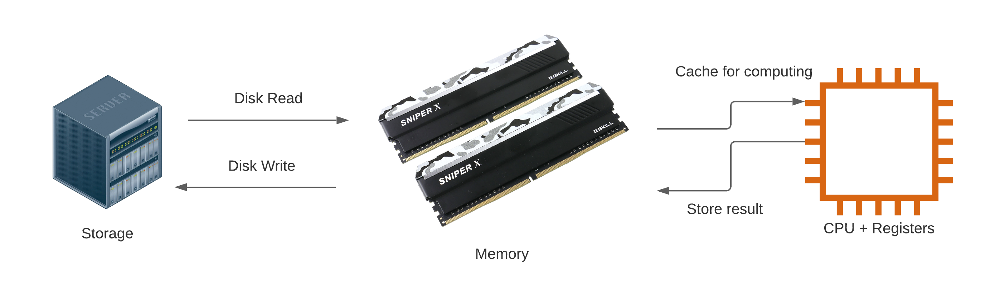

## Environment Set Up

Install R from https://cran.r-project.org/ and Rstudio from https://www.rstudio.com/products/rstudio/download/#download

Install required packages in R:
```{r eval=FALSE}
install.packages(c("tidyverse", "data.table", "arrow", "duckdb"))
```

Dwnload and extract the data used in the examples and exercises from https://www.dropbox.com/s/vbodicsu591o7lf/original_csv.zip?dl=1 (this is a 1.3Gb zip file). These data record for-hire vehicle (aka "ride sharing") trips in NYC in 2020. Each row contains the record of a trip and the variable descriptions can be found in https://www1.nyc.gov/assets/tlc/downloads/pdf/data_dictionary_trip_records_hvfhs.pdf

You can download it using R if you wish:

```{r}
if(!file.exists("original_csv.zip")) {
  download.file("https://www.dropbox.com/s/vbodicsu591o7lf/original_csv.zip?dl=1", "original_csv.zip")
  unzip("original_csv.zip")
}
```

## Nature and Scope of the Problem: What is Large Data?

We can use the term "large data" as a broader category of "data that is big enough that you have to pay attention to processing it efficiently". 

In a typical (traditional) program, we start with data on disk, in some format. We read it in to memory, do some stuff to it on the CPU, store the results of that stuff back in memory, then write those results back to disk so they can be available for the future, as depicted below.



## Problem example

Grounding our discussion in a concrete problem example will help make things clear. **I want to know how many Lyft rides were taken in New York City during 2020**. The data is publicly available as documented at https://www1.nyc.gov/site/tlc/about/tlc-trip-record-data.page and I have made a subset available on dropbox as described in the Setup section above for convenience. Documentation can be found at https://www1.nyc.gov/assets/tlc/downloads/pdf/data_dictionary_trip_records_hvfhs.pdf

In order to demonstrate large data problems and solutions I'm going to artificially limit my system to 4Gb of memory. This will allow us to quickly see what happens when we reach the memory limit, and to look at solutions to that problem without waiting for our program to read in hundreds of Gb of data. (There is no need to follow along with this step, the purpose is just to make sure we all know what happens when you run out of memory.)

Start by looking at the file names and sizes:
```{r}
fhvhv_csv_files <- list.files("original_csv/", recursive = TRUE, full.names = TRUE)
data.frame(file = fhvhv_csv_files, size_Mb = file.size(fhvhv_csv_files)/ 1024^2)
```

Try to read them in

```{r eval=FALSE}

```

If you're working with data large enough to hit the dreaded `cannot allocate vector` error when running your code, you've got a problem.


*An example of a large object causing a bottleneck*

When you hit a  memory bottleneck you can write more memory-efficient code,  buy more memory, or both.


## General strategies and principles

The main techniques we'll look at today are:

### Use a fast binary data storage format that enables reading data subsets

The `parquet` binary storage format is among the best currently available. Support in R is provided by the `arrow` package.

### Partition the data on disk to facilitate chunked access and computation

Memory requirements can be reduced by partitioning the data and computation into chunks, running each one sequentially, and combining the results at the end. 


### Only read in the data you need

You can turn many large data problems in to medium data by being careful not to read in data you never use.

### Use streaming data tools and algorithms

Processing data in a streaming fashion allows you to work with data that is too large to fit in memory.

### Avoid unnecessarily storing or duplicating data in memory

Remove or avoid storing intermediate results you don't need and take care not to make copies of your data structures unless you have to.

## Solution example

Now that we have some theoretical foundations to build on we can start putting these techniques into practice. Using the techniques identified above will allow us to overcome the memory limitation we ran up against before, and finally answer the question "**How many Lyft rides were taken in New York City during 2020?**"?

### Convert .csv to parquet

The first step is to take the slow and inefficient text-based data provided by the city of New York and convert it to parquet using the `arrow` package.

```{r message=FALSE}
library(arrow)

csv_ds <- open_dataset("original_csv",
                       format = "csv",
                       partitioning = c("year", "month"))

write_dataset(csv_ds,
              "converted_parquet",
              format = "parquet",
              partitioning = c("year", "month"))
```

Look at the converted files and compare the naming scheme and storage requirements to the original CSV data.

```{r}
fhvhv_csv_files <- list.files("original_csv", recursive = TRUE, full.names = TRUE)
fhvhv_files <- list.files("converted_parquet", recursive = TRUE, full.names = TRUE)

data.frame(csv_file = fhvhv_csv_files, parquet_file  = fhvhv_files,
           csv_size_Mb = file.size(fhvhv_csv_files)/1024^2, 
           fhvhv_sizedMb = file.size(fhvhv_files)/1024^2)
```


### Read and count Lyft records with arrow

The `arrow` package makes it easy to read and process only the data we need for a particular calculation. It allows us to use the partitioned data directories we created earlier as a single dataset and to query it using the `dplyr` verbs many R users are already familiar with.

Start by creating a dataset representation from the partitioned data directory:

```{r}
fhvhv_ds <- open_dataset("converted_parquet",
                         schema = schema(hvfhs_license_num=string(),
                                         dispatching_base_num=string(),
                                         pickup_datetime=string(),
                                         dropoff_datetime=string(),
                                         PULocationID=int64(),
                                         DOLocationID=int64(),
                                         SR_Flag=int64(),
                                         year=int32(),
                                         month=int32()))
```

Compute the number of NYC Lyft trips in 2020, even on a machine with limited memory:

```{r}
library(dplyr)

fhvhv_ds %>%
  filter(hvfhs_license_num == "HV0005") %>%
  select(hvfhs_license_num) %>%
  collect() %>%
  summarize(total_Lyft_trips = n())
```

### Efficiently query taxi data with duckdb

If you need even more speed and convenience you can use the `duckdb` package. You can use either SQL statements via the `DBI` package or tidyverse style verbs using `dbplyr`.

First we create a `duckdb` table from our `arrow` dataset.
```{r message=FALSE}

```

The `duckdb` table can be queried using tidyverse style verbs or SQL.
```{r}

```
The main advantages of `duckdb` are that it has full SQL support, supports aggregating data in a streaming fashion, allows you to set memory limits, and is optimized for speed.

It can be instructive to compare `arrow` and `duckdb` capabilities and performance using a slightly more complicated example. Here we compute a grouped average using `arrow`:

```{r}

```

Here is the same query using `duckdb`:

```{r}

```


## Your turn!

Now that you understand some of the basic techniques for working with large data and have seen an example, you can start to apply what you've learned. Using the same taxi data, try answering the following questions:

- What percentage of trips are made by Lyft?
- In which month did Lyft log the most trips?

Documentation for these data can be found at https://www1.nyc.gov/assets/tlc/downloads/pdf/data_dictionary_trip_records_hvfhs.pdf


## Additional resources

- [Arrow R package documentation](https://arrow.apache.org/docs/r/)
- [Arrow Python package documentation](https://arrow.apache.org/docs/python/)
- [DuckDB documentation](https://duckdb.org/docs/)

